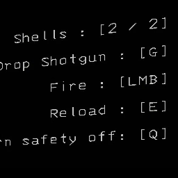

# ShotgunAmmoHUD

A small [Lethal Company](https://store.steampowered.com/app/1966720/) mod that shows how many
shells are loaded in the shotgun you're holding.

It adds one line — `Shells : [1 / 2]` — to the game's control-tip panel, right above the usual
shotgun tips. The line is cloned from the game's own control-tip text, so it matches the in-game
font and style exactly.

Settings can be changed in-game if you have
[LethalConfig](https://thunderstore.io/c/lethal-company/p/ainavt/LethalConfig/) installed (optional).

## Install
Easiest: install with a mod manager (r2modman or Thunderstore Mod Manager).

Manual:
1. Install [BepInEx](https://thunderstore.io/c/lethal-company/p/BepInEx/BepInExPack/).
2. Put `ShotgunAmmoHUD.dll` and `icon.png` in `BepInEx/plugins/ShotgunAmmoHUD`.

## Settings
In-game via LethalConfig, or by editing `BepInEx/config/oddninja.shotgunammohud.cfg`:

| Setting | Default | What it does |
| --- | --- | --- |
| Enabled | `true` | Show the ammo line. |
| ShowOnlyWhenHeld | `true` | Only when a shotgun is the held item (otherwise also when one is in another slot). |
| HideInTerminal | `true` | Hide while using the terminal. |
| ShowWhenEmpty | `true` | Show even when 0 shells are loaded. |
| MaxShells | `2` | The number shown after the slash. |
| Format | `Shells : [{ammo} / {max}]` | The line's text. `{ammo}` and `{max}` are filled in. |

## License
[MIT](LICENSE)
